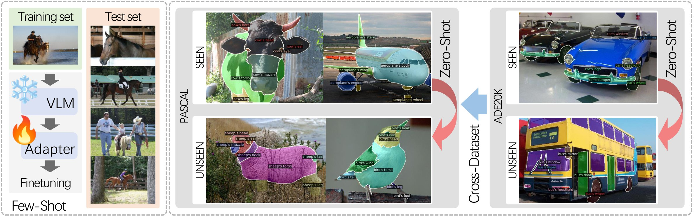

<br>
<p align="center">
<h1 align="center"><strong>OV-PARTS: Towards Open-Vocabulary Part Segmentation</strong></h1>
  <p align="center">
    <a href='https://github.com/kellyiss/' target='_blank'>Meng Wei</a>&emsp;
    <a href='https://yuexy.github.io/' target='_blank'>Xiaoyu Yue</a>&emsp;
    <a href='http://zhangwenwei.cn/' target='_blank'>Wenwei Zhang</a>&emsp;
    <a href='https://xh-liu.github.io/' target='_blank'>Xihui Liu</a>&emsp;
    <a href='https://aimerykong.github.io/' target='_blank'>Shu Kong</a>&emsp;
    <a href='https://oceanpang.github.io/' target='_blank'>Jiangmiao Pang*</a>&emsp;
    <br>
    Shanghai AI Laboratory&emsp;The University of Hong Kong&emsp;The University of Sydney&emsp;University of Macau&emsp;Texas A&M University
  </p>
</p>

<p align="center">
  <a href="https://openreview.net/forum?id=EFl8zjjXeX&" target='_blank'>
    
  </a> 
</p>

## 🏠 About
<div style="text-align: center;">

</div>

**OV-PARTS** is a benchmark for Open-Vocabulary Part Segmentation by using the capabilities of large-scale Vision-Language Models (VLMs). 

- **Benchmark Datasets**: Two refined versions of two publicly available datasets: 
  - *[Pascal-Part-116](https://drive.google.com/file/d/1hsbwNdfPe4c6yVLZDjzjPTC7NL65I-rr/view?usp=sharing)*
  - *[ADE20K-Part-234](https://drive.google.com/file/d/1EBVPW_tqzBOQ_DC6yLcouyxR7WrctRKi/view)*

- **Benchmark Tasks**: Three specific tasks which provides insights into the `analogical reasoning`, `open granularity` and `few-shot adapting ` abilities of models. 
  - *Generalized Zero-Shot Part Segmentation*: this benchmark task aims to assess the model’s capability to generalize part segmentation from seen objects to related unseen objects.
  - *Cross-Dataset Part Segmentation*: except for the zero-shot generalization ability, this benchmark task aims to assess the model’s capability to generalize part segmentation across different datasets with varying granularity levels.
  - *Few-Shot Part Segmentation*: this benchmark task aims to assess the model’s fast adaptation capability.

- **Benchmark Baselines**: Baselines based on existing two-stage and one-stage object-level open vocabulary segmentation methods, including [ZSseg](https://arxiv.org/pdf/2112.14757.pdf), [CLIPSeg](https://arxiv.org/pdf/2112.10003.pdf), [CATSeg](https://arxiv.org/pdf/2303.11797.pdf).

## 🔥 News
We organize the Open Vocabulary Part Segmentation (OV-PARTS) Challenge in the [Visual Perception via Learning in an Open World (VPLOW) Workshop](https://vplow.github.io/vplow_4th.html). Please check our [website](https://ov-parts.github.io/)!

## 🛠 Getting Started
### Installation
1. Clone this repository
    ```bash
    git clone https://github.com/OpenRobotLab/OV_PARTS.git
    cd OV_PARTS
    ```

2. Create a conda environment with `Python3.8+` and install python requirements
    ```bash
    conda create -n ovparts python=3.8
    conda activate ovparts
    pip install -r requirements.txt
    ```

### Data Preparation
  After downloading the two benchmark datasets, please extract the files by running the following command and place the extracted folder under the "Datasets" directory.
  ```bash
  tar -xzf PascalPart116.tar.gz
  tar -xzf ADE20KPart234.tar.gz
  ```
  The Datasets folder should follow this structure:
  ```shell
  Datasets/
  ├─Pascal-Part-116/
  │ ├─train_16shot.json
  │ ├─images/
  │ │ ├─train/
  │ │ └─val/
  │ ├─annotations_detectron2_obj/
  │ │ ├─train/
  │ │ └─val/
  │ └─annotations_detectron2_part/
  │   ├─train/
  │   └─val/
  └─ADE20K-Part-234/
    ├─images/
    │ ├─training/
    │ ├─validation/
    ├─train_16shot.json
    ├─ade20k_instance_train.json
    ├─ade20k_instance_val.json
    └─annotations_detectron2_part/
      ├─training/
      └─validation/
  ```
  Create `{train/val}_{obj/part}_label_count.json` files for Pascal-Part-116.
  ```bash
  python baselines/data/datasets/mask_cls_collect.py Datasets/Pascal-Part-116/annotations_detectron2_{obj/part}/{train/val} Datasets/Pascal-Part-116/annotations_detectron2_part/{train/val}_{obj/part}_label_count.json
  ```

### Training
1. Training the two-stage baseline `ZSseg+`.

    Please first download the clip model fintuned with [CPTCoOp](https://drive.google.com/drive/folders/1ME6cVMiYE5Z2yZscP_jj2g1NwamIApw1?usp=sharing).

    Then run the training command:
    ```bash
    python train_net.py --num-gpus 8 --config-file configs/${SETTING}/zsseg+_R50_coop_${DATASET}.yaml
    ```

2. Training the one-stage baselines `CLIPSeg` and `CATSeg`. 

    Please first download the pre-trained object models of CLIPSeg and CATSeg and place them under the "pretrain_weights" directory.

    | Models | Pre-trained checkpoint |
    |:----------:|:-------------:|
    | CLIPSeg | [download](https://huggingface.co/CIDAS/clipseg-rd64-refined) |
    | CATSeg | [download](https://huggingface.co/hamacojr/CAT-Seg/blob/main/model_final_base.pth) |

    Then run the training command:
    ```bash
    # For CATseg.
    python train_net.py --num-gpus 8 --config-file configs/${SETTING}/catseg_${DATASET}.yaml

    # For CLIPseg.
    python train_net.py --num-gpus 8 --config-file configs/${SETTING}/clipseg_${DATASET}.yaml
    ```

    

### Evaluation
We provide the trained weights for the three baseline models reported in the paper.

| Models | Setting | Pascal-Part-116 checkpoint | ADE20K-Part-234 checkpoint |
|:------:|:-------:|:----------:|:----------:|
| ZSSeg+ | Zero-shot | [download](https://drive.google.com/file/d/10evrfHIRARbil5WSaziFth1aAFeky185/view) |[download](https://drive.google.com/file/d/1ayb5n-bVI0oBQxYzojj0o0yN6bnCuum8/view) |
| CLIPSeg | Zero-shot | [download](https://drive.google.com/file/d/1WkCu3-KA2Oho5xzBXDR_HUmBvvKKYSQM/view) | [download](https://drive.google.com/file/d/1Ydh1wn1H8TPVrO24TaAIUMMLhqAPXH-W/view) |
| CatSet | Zero-shot | [download](https://drive.google.com/file/d/11OOO5NmJkkeJl5oTbxbTZUgFyFXSKVRZ/view) |[download](https://drive.google.com/file/d/1jvGQtftwRuzbFnphQXftosdL_YDwMWAx/view) |
| CLIPSeg | Few-shot | [download](https://drive.google.com/file/d/1WPDoc4igtDQ9H46Wwp4aaHXgu4gMNICO/view) |[download](https://drive.google.com/file/d/1LCCBCgRqqerf2ZYLfClm4a_hP8dWZGzv/view) |
| CLIPSeg | cross-dataset | - |[download](https://drive.google.com/file/d/1G5SMWhZ0UwAiW2CvEDXpxPhfksN33hKp/view?usp=sharing) |

To evaluate the trained models, add ```--eval-only``` to the training command.

For example:
```bash
  python train_net.py --num-gpus 8 --config-file configs/${SETTING}/catseg_${DATASET}.yaml --eval-only MODEL.WEIGHTS ${WEIGHT_PATH}
```

## 📝 Benchmark Results
- Zero-shot performance of the two-stage and one-stage baselines on Pascal-Part-116

  | Model      | Backbone      | Finetuning   |          |    Oracle-Obj       |              |          |    Pred-Obj   |                |
  |------------|---------------|--------------|----------|---------------------|--------------|----------|---------------|----------------|
  |            |               |              | *Seen*   |      *Unseen*       |  *Harmonic*  | *Seen*   |  *Unseen*     |  *Harmonic*    |
  | *Fully-Supervised*         |              |          |          |          |              |          |               |                |
  | MaskFormer | ResNet-50     | -            | 55.28    |      52.14          |        -     | 53.07    |     47.82     |        -       |
  | *Two-Stage Baselines*      |              |          |          |          |              |          |               |                |
  | ZSseg      | ResNet-50     | -            | 49.35    |      12.57          |     20.04    | 40.80    |     12.07     |      18.63     |
  | ZSseg+     | ResNet-50     | CPTCoOp      | 55.33    |      19.17          |     28.48    | 54.23    |     17.10     |      26.00     |
  | ZSseg+     | ResNet-50     | CPTCoCoOp    | 54.43    |      19.04          |     28.21    | 53.31    |     16.08     |      24.71     |
  | ZSseg+     | ResNet-101c   | CPTCoOp      | **57.88**    |      **21.93**          |     **31.81**    | **56.87**    |     **20.29**     |      **29.91**     |
  | *One-Stage Baselines*      |              |          |          |          |              |          |               |                |
  | CATSeg     | ResNet-101 <br>&ViT-B/16| -  | 14.89    |      10.29          |     12.17    | 13.65    |     7.73      |      9.87      |
  | CATSeg     | ResNet-101 <br>&ViT-B/16| B+D| 43.97    |      26.11          |     32.76    | 41.65    |     26.08     |      32.07     |
  | CLIPSeg    | ViT-B/16      |            - | 22.33    |      19.73          |     20.95    | 14.32    |     10.52     |      12.13     |
  | CLIPSeg    | ViT-B/16      | VA+L+F+D     | **48.68**    |      **27.37**          |     **35.04**    | **44.57**    |     **27.79**     |      **34.24**     |

- Zero-shot performance of the two-stage and one-stage baselines on ADE20K-Part-234

  | Model      | Backbone      | Finetuning   |          |    Oracle-Obj       |              |          |    Pred-Obj   |                |
  |------------|---------------|--------------|----------|---------------------|--------------|----------|---------------|----------------|
  |            |               |              | *Seen*   |      *Unseen*       |  *Harmonic*  | *Seen*   |  *Unseen*     |  *Harmonic*    |
  | *Fully-Supervised*         |              |          |          |          |              |          |               |                |
  | MaskFormer | ResNet-50     | -            | 46.25    | 47.86               |       -      | 35.52    |     16.56     |        -       |
  | *Two-Stage Baselines*      |              |          |          |          |              |          |               |                |
  | ZSseg+     | ResNet-50     | CPTCoOp      | 43.19    |      **27.84**          |     **33.85**    | 21.30    |      **5.60**     |       **8.87**     |
  | ZSseg+     | ResNet-50     | CPTCoCoOp    | 39.67    |      25.15          |     30.78    | 19.52    |      2.98     |       5.17     |
  | ZSseg+     | ResNet-101c   | CPTCoOp      | **43.41**    |      25.70          |     32.28    | **21.42**    |      3.33     |       5.76     |
  | *One-Stage Baselines*      |              |          |          |          |              |          |               |                |
  | CATSeg     | ResNet-101 <br>&ViT-B/16| -  | 11.49    |      8.56           |     9.81     | 6.30     |      3.79     |       4.73     |
  | CATSeg     | ResNet-101 <br>&ViT-B/16| B+D| 31.40    |      25.77          |     28.31    | 20.23    |      **8.27**     |       **11.74**    |
  | CLIPSeg    | ViT-B/16      |            - | 15.27    |      18.01          |     16.53    |  5.00    |      3.36     |       4.02     |
  | CLIPSeg    | ViT-B/16      | VA+L+F+D     | **38.96**    |      **29.65**          |     **33.67**    | **24.80**    |      6.24     |       9.98     |

- Cross-Dataset performance of models trained on the source dataset ADE20K-Part-234 and tested on the target dataset Pascal-Part-116.
  | Model      |          |  Source  |          |  Target  |
  |------------|:--------:|:--------:|:--------:|:--------:|
  |            |Oracle-Obj|  Pred-Obj|Oracle-Obj|  Pred-Obj|
  | CATSeg     | 27.95    |  17.22   | 16.00    |  **14.72** |
  | CLIPSeg VA+L+F| 35.01 |  21.74   | 16.18    |  11.70   |
  | CLIPSeg VA+L+F+D|**37.76**|**21.87**|**19.69**|13.88   |


## 🔗 Citation

If you find our work helpful, please cite:

```bibtex
@inproceedings{wei2023ov,
  title={OV-PARTS: Towards Open-Vocabulary Part Segmentation},
  author={Wei, Meng and Yue, Xiaoyu and Zhang, Wenwei and Kong, Shu and Liu, Xihui and Pang, Jiangmiao},
  booktitle={Thirty-seventh Conference on Neural Information Processing Systems Datasets and Benchmarks Track},
  year={2023}
}
```

## 👏 Acknowledgements
We would like to express our gratitude to the open-source projects and their contributors, including [ZSSeg](https://github.com/MendelXu/zsseg.baseline), [CATSeg](https://github.com/KU-CVLAB/CAT-Seg) and [CLIPSeg](https://github.com/timojl/clipseg). Their valuable work has greatly contributed to the development of our codebase.

